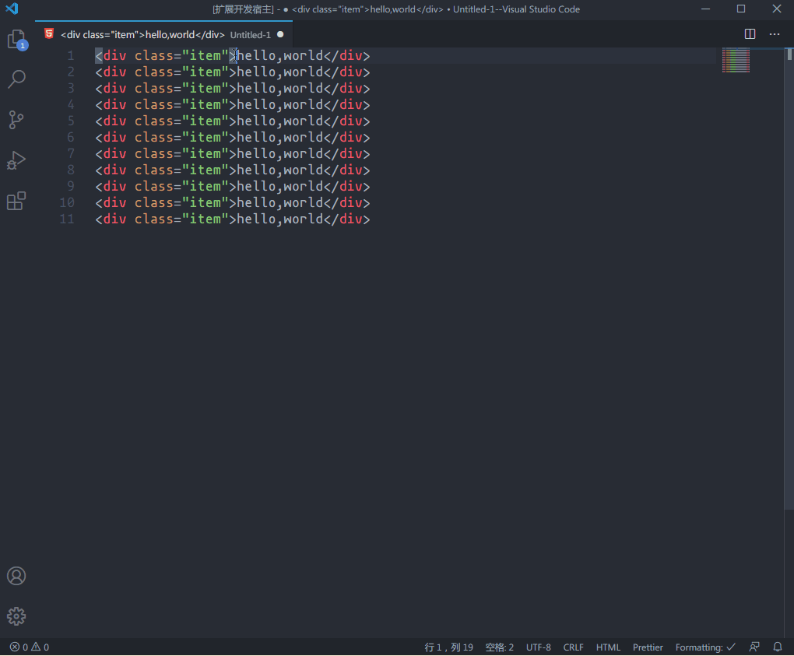

# vscode 自增字符串插件

## 功能

- 支持阿拉伯数字和中文数字显示

- 自增表达式: n\*m
  > 其中 n 代表基础数值, m 代表增量数值, n 默认为 0

例子:

- +1

  > 结果: 1,2,3,4,5....

  > 中文结果: 一,二,三,四,五....

- 2+3

  > 结果 5,8,11,14,17....

- 50+50
  > 结果 100, 150,200,250....
